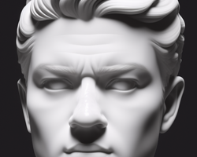

This is not a deep learning model, unless you can learn something from my thoughts.

All the information provided here is intended to be helpful and useful to those who read it, but it is not intended to be exhaustive or complete - if you are looking for code snippets, you'll find in any of my other repos, but this one.

The views and opinions expressed in the following topics are based in my personal opinion and do not necessarily reflect positions of any organization or company.

---

<table>
  <tr>
    <th width="33%">
      <a href="https://github.com/alan-oliv/unstable-thought-diffusion/blob/main/when-refactor-becomes-therapy/README.md">
        </img>
      </a>
    </th>
    <th width="33%">
      <a href="https://github.com/alan-oliv/unstable-thought-diffusion/blob/main/a-devs-eudaimonia/README.md">
        </img>
      </a>
    </th>
    <th width="33%">
      <a href="https://github.com/alan-oliv/unstable-thought-diffusion/blob/main/over-engineering-horror/README.md">
        </img>
      </a>
    </th>
  </tr>

  <tr>
    <td width="33%">
      <a href="https://github.com/alan-oliv/unstable-thought-diffusion/blob/main/when-refactor-becomes-therapy/README.md">
        <br/>
        
        <br/>
        When refactoring becomes therapy
      </a>
      <br/>
      <p>May 2, 2025</p>
    </td>
    <td width="33%">
      <a href="https://github.com/alan-oliv/unstable-thought-diffusion/blob/main/a-devs-eudaimonia/README.md">
        <br/>
        
        <br/>
        A dev's "Eudaimonia"
      </a>
      <br/>
      <p>Aug 15, 2024</p>
    </td>
    <td width="33%">
      <a href="https://github.com/alan-oliv/unstable-thought-diffusion/blob/main/over-engineering-horror/README.md">
        <br/>
        
        <br/>
        Over-engineering horror
      </a>
      <br/>
      <p>May 10, 2024</p>
    </td>
  </tr>
</table>

<table>
  <tr>
  <th width="33%">
      <a href="https://github.com/alan-oliv/unstable-thought-diffusion/blob/main/solid-front-end/README.md">
        </img>
      </a>
    </th>
  <th width="33%">
      <a href="https://github.com/alan-oliv/unstable-thought-diffusion/blob/main/musician-programmer/README.md">
        </img>
      </a>
    </th>
    <th width="33%">
      <a href="https://github.com/alan-oliv/unstable-thought-diffusion/blob/main/pair-less-programming/README.md">
        </img>
      </a>
    </th>
  </tr>

  <tr>
    <td width="33%">
      <a href="https://github.com/alan-oliv/unstable-thought-diffusion/blob/main/solid-front-end/README.md">
        <br/>
        
        <br/>
        A solid front-end
      </a>
      <br/>
      <p>Mar 22, 2024</p>
    </td>
      <td width="33%">
      <a href="https://github.com/alan-oliv/unstable-thought-diffusion/blob/main/musician-programmer/README.md">
        <br/>
        
        <br/>
        Musician programmer
      </a>
      <br/>
      <p>Jan 20, 2024</p>
    </td>
    <td width="33%">
      <a href="https://github.com/alan-oliv/unstable-thought-diffusion/blob/main/pair-less-programming/README.md">
        <br/>
        
        <br/>
        Pair(less) programming
      </a>
      <br/>
      <p>December 15, 2023</p>
    </td>
  </tr>
</table>

---

### Adding a new post

From the repo root, run:

```bash
npm install
npx tsx cli.ts add --template <essay|concept|story|short>
```

Or use the short form: `npx tsx cli.ts add -t essay`. The CLI creates a new post from the chosen template with auto-generated placeholder data and updates `POSTS.md` and this README. Replace the title, date, and body content in the new post manually. Add `thumbnail.png` (and optionally `article-01.png`, `article-02.png`, etc.) to the post's `static/` folder so the post appears correctly in the index above.
