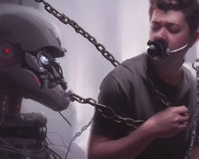

# unstable-thought-diffusion

This is not a deep learning model, unless you can learn something from my thoughts.

All the information provided here is intended to be helpful and useful to those who read it, but it is not intended to be exhaustive or complete - if you are looking for code snippets, you'll find in any of my other repos, but this one.

The views and opinions expressed in the following topics are based in my personal opinion and do not necessarily reflect positions of any organization or company.

---

<table>
  <tr>
    <th width="33%">
      <a href="https://github.com/alan-oliv/unstable-diffusion/blob/main/over-engineering-horror/README.md">
        </img>
      </a>
    </th>
    <th width="33%">
      <a href="https://github.com/alan-oliv/unstable-diffusion/blob/main/solid-front-end/README.md">
        </img>
      </a>
    </th>
    <th width="33%">
      <a href="https://github.com/alan-oliv/unstable-diffusion/blob/main/musician-programmer/README.md">
        </img>
      </a>
    </th>
  </tr>

  <tr>
    <td width="33%">
      <a href="https://github.com/alan-oliv/unstable-diffusion/blob/main/over-engineering-horror/README.md">
         
        
         
        Over-engineering horror
      </a>
       
      
January 10, 2023

    </td>
    <td width="33%">
      <a href="https://github.com/alan-oliv/unstable-diffusion/blob/main/solid-front-end/README.md">
         
        
         
        A solid front-end
      </a>
       
      
December 22, 2022

    </td>
    <td width="33%">
      <a href="https://github.com/alan-oliv/unstable-diffusion/blob/main/musician-programmer/README.md">
         
        
         
        Musician programmer
      </a>
       
      
December 20, 2022

    </td>
  </tr>
</table>

<table>
  <tr>
    <th width="33%">
      <a href="https://github.com/alan-oliv/unstable-diffusion/blob/main/pair-less-programming/README.md">
        </img>
      </a>
    </th>
    <th width="33%">
        </img>
    </th>
    <th width="33%">
        </img>
    </th>
  </tr>

  <tr>
    <td width="33%">
      <a href="https://github.com/alan-oliv/unstable-diffusion/blob/main/pair-less-programming/README.md">
         
        
         
        Pair(less) programming
      </a>
       
      
December 15, 2022

    </td>
    <td width="33%"> </td>
    <td width="33%"></td>
  </tr>
</table>
