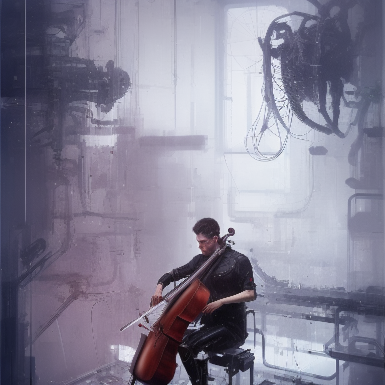
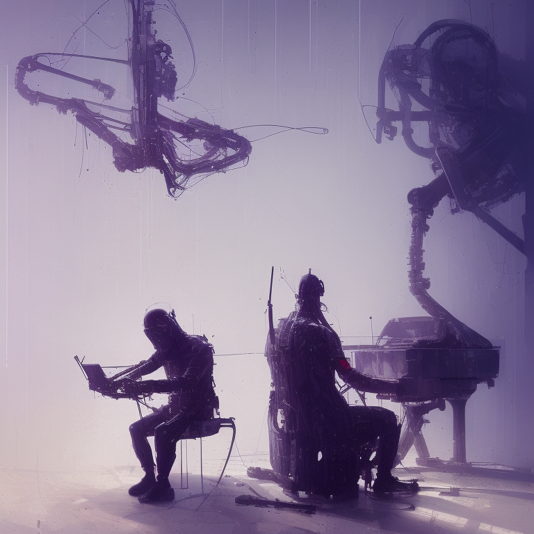
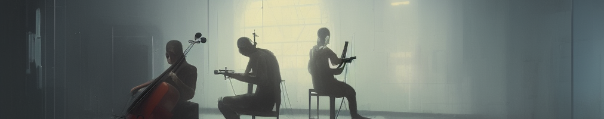

  
  

---

# Musician programmer

I've lost count of how many times when chatting virtually with another developer, I saw a musical instrument in the background, am I tripping?

Is it just me or is there a strong correlation between music and programming?

### The greatest scientists are artists as well

> _"After a certain high level of technical skill is achieved, science and art tend to coalesce in aesthetics, plasticity, and form. **The greatest scientists are always artists as well**” - Einstein Archive 33-257._

My father was an artist, the smartest and wisest man I've ever known, he taught me the most important things about life. I had the opportunity to see in firsthand how challenging and demanding an oil painting is: creativity and imagination, problem-solving, critical thinking, reasoning, attention to detail, and focus were some of the skills he used every day.

As a programmer and cellist, I need those as well. That's why I very much agree with Albert.

For me, musical ability appears to be a reliable indicator of success in coding and the reason for that is that engineering minds love the mechanics of music, at least I do. And as a musician and programmer, here are my thoughts:

---

I'll start with one of the first things we learn as programmers, declaring a **variable**:

#### Variables and data-types

In programming, a **variable** is a named location in a program's memory that is used to store and access data. This data can be of various types such as `number`, `string`, `boolean` or other data types.

Well, when reading a musical piece, we also have variables such as time signatures, key signatures, dynamics, and even the pitch of a melody that could be considered as a variable since it can vary from note to note. Oh, and they also have their own data types like `note`, `pitch`, `duration`, `chord` (that would be a `note[]`), `measure` (`chord[]` or `note[]` depending on if you play a harmonical or melodic instrument), and so on...

#### Functions

Right after that, we have **functions**, that is a block of code (that may use variables) to perform a specific task and can be called from other parts of the program. A function is like a little component, right? It's the smallest part that allows us to break down our code into smaller, reusable units that can be called we need

Funny concept, what's funniest is that in music this is clearly a motif (or motive) which is the same thing - it's a short musical idea or phrase that is repeated or varied throughout a piece and they can be used to create larger musical structures like a theme, that will give the music a sense of direction.

#### Modules

So if the motif is a function, the theme is clearly what we programmers would call a module, which is a self-contained "box" (bigger than a function) that also performs a specific task or serves a specific purpose.
We can think of it as a collection of functions where each of those functions will return an array of instructions, making the musical sheet a collection of instructions, or a multi-dimensional array as we know.

About modules, the module pattern is a design pattern defined by modular programming, and it's pretty common these days. Cool stuff. How do we use that?

#### Flow control structures

In music, patterns and repetition can be found in the use of themes (or sections), which are those building blocks that we just read about. But how?

Consider the binary form in music (usually found in classical and particularly Baroque music pieces), which is a structure that divides a piece of music into two main sections (themes) that are repeated.

What? Repeated?
What's the most basic flow control structure in programming? Loops.
The concept of a loop in programming says that a block of code is executed repeatedly until a certain condition is met.

So it's like we are importing 2 different themes (modules) and repeating them? How do we do that in music? Using a ritornello.
  

And as the loop, a ritornello could (or not) be modified slightly each time it is repeated (through the addition of new instruments or voices), again, until a certain condition is met (we have conditionals in music as well) - which means that ritornello is a flow control structure.

Wait, we just saw **basic syntax, data types structure, design patterns, and flow control structures (conditionals and loops)** which are the foundation of programming (and music, it seems)

There are a lot of other things that I think music and coding are exactly the same mathematically speaking or mirroring specific design patterns, but if I go over all of them this post is going to be boring (if it's not already)

Ok, one more thing: As a musician, teachers often ask you to "interpret" a piece - when doing it, they can ask you to play louder, or say that it's too slow, too fast, too staccato or not staccato enough.

When this happens, you are learning how to act as a "code" **interpreter**, which is responsible for executing the code that some programmer wrote, turning it into low-level language that the computer can understand and execute.

---

</img>

---

Like the code "interpreter", a musician's mind works at a high rate of speed, data is being processed very quickly; the theory, potential choices, and musical notes go through a filtering process until a musical decision is made - similar to a computer's central processing unit.

Or… I could be just tripping.
