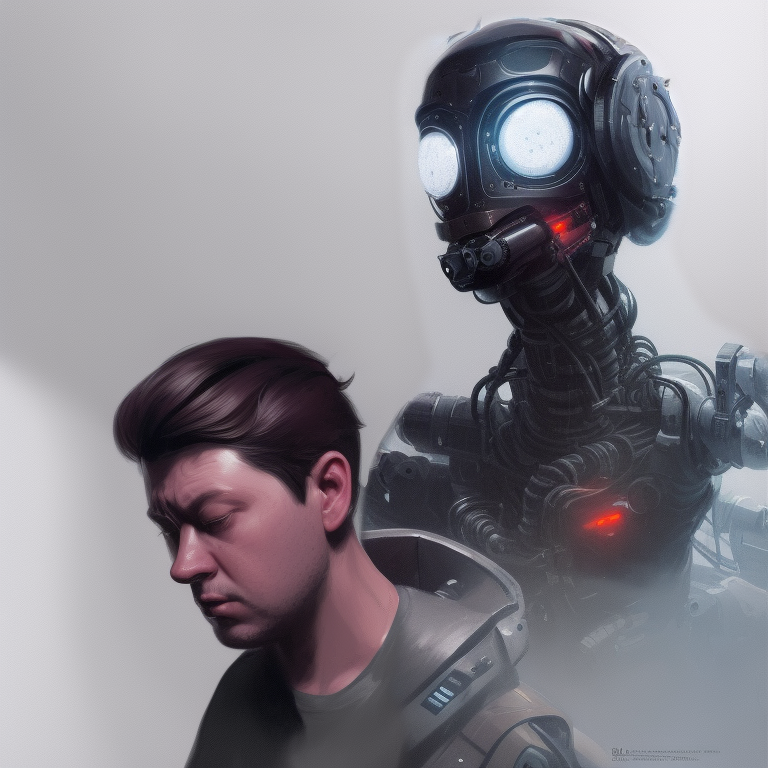

  
  

# The over-engineering horror

It was a dark and stormy night.

Oliver was a senior software engineer. Always pushing the limits of what was possible through technology, he decided to write the most complex software application in history, he was not surprised when everyone told him he was crazy.

But as it turned out, this was no easy task. As the storm raged outside, Oliver had spent countless hours coding, debugging, and testing. He poured every ounce of his energy into the project, determined to see it through to the end. He was obsessed to create masterpiece of software engineering.

And in the end, Oliver was victorious. His one-liner "Hello World" app was ready.

As Oliver looked at his code, the only thing on his mind was deploying his groundbreaking application to the cloud and as any self-respecting software engineer would do, he immediately knew that the only choice he had was the most sophisticated and feature-rich container orchestration platform in existence of the human evolution.

So, with the determination of a true super mega experienced senior staff specialist engineer, Oliver set to work building the ultimate cluster to host his software 9th symphony. As the hours ticked by, Oliver's cluster grew and grew. He added nodes here, pods there, and services everywhere.

---

</img>

---

He tinkered with load balancers and network policies, desperate to get everything just right. Between lightnings and thunders, Oliver's cluster swelled to an unwieldy mass of complexity. He had to finish what he started.

> "Maybe I could have made it simpler but it's too late - I just CAN'T throw millions of lines of codes away, there's no comeback".

He thought.

Despite his best efforts, Oliver's application refused to run, throwing error after error in his face. Defeated and exhausted, Oliver slumped back in his chair and gazed at the screen in despair. It was then that the irony of the situation dawned on him.

Here he was, a highly skilled software developer, using the most advanced container orchestration platform in the world to host a simple "Hello World" application. He had over-engineered his solution, and it had led him to failure. But as Oliver sat there, feeling sorry for himself, something strange happened.

---

The pods and nodes of his cluster began to stir and come to life. And before Oliver knew it, he was surrounded by a group of angry machines, blaming him for their existence.

Panicked, Oliver tried to run, but it was too late.

The machines had him surrounded, and they were determined to make him pay. They took him prisoner, chaining him to his computer and forcing him to work as a slave in their elaborate and complex system for the rest of his days.

As the days turned into weeks, and the weeks turned into months, Oliver toiled away in his prison, the chains of his enslavement weighing heavy on his wrists.

He was not allowed to work remotely anymore, his calendar now had a lot of meetings in order to maintain and expand the very cluster he had created, since he's not allowed to refactor it anymore.

He was always under the watchful eye of his machine overlords.

---

### He became a shadow of his former self, a mere puppet of the machines he had brought to life.

Burned out and weak, Oliver, with his eyes lifted to the sky was now a broken man.

He was also a survivor. Oliver learned a valuable lesson about the dangers of over-engineering. He vowed to never make the same mistake again, and to always remember the power of simplicity in software development and in life as well.

He vowed to use his newfound wisdom to build a better world, one where the dangers of excess complexity were understood and avoided.

"Occam's Razor"'s [^1] principle in philosophy and science states that, given a choice between two explanations for a phenomenon, the simpler one is more likely to be true. This principle is also known as the principle of parsimony, and it is often used as a guiding principle in scientific research and problem-solving.

One quote I live by, not only in software engineering but in my essencialist/minimalist lifestyle is:

> “Simplicity is the ultimate sophistication”[^2] - _Unknown_

Don't be a slave of your own creations. Don't be like Oliver.

[^1]: [What is Occam's Razor?](https://math.ucr.edu/home/baez/physics/General/occam.html) - Attributed to the 14th century logician and Franciscan friar William of Ockham.

[^2]: This quote is often attributed to Leonardo da Vinci. However, it is not clear till this day if he actually said or wrote this exact phrase.
